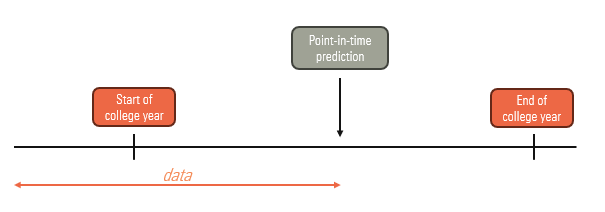
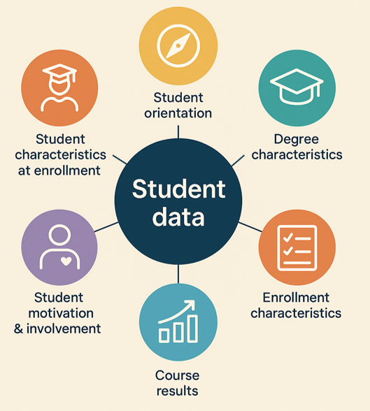
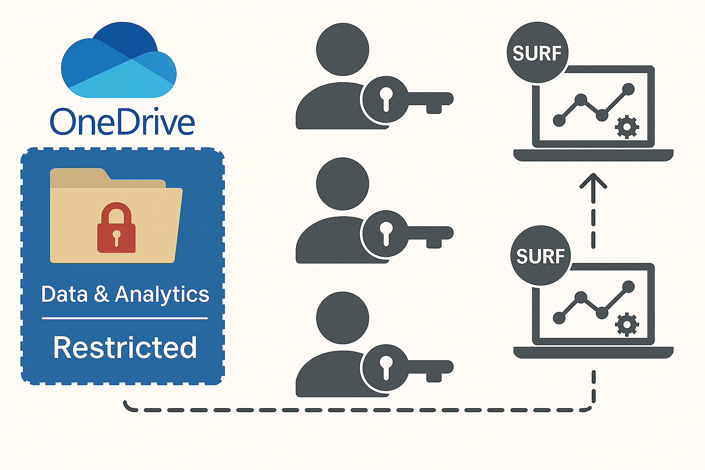

# Predicting student drop-out
<a target="_blank" href="https://cookiecutter-data-science.drivendata.org/">
    
</a>

Project Lead = Bouba Ismalia & Fraukje Coopmans ([Data Science Pool](https://datasciencepool.hu.nl/))

## Hands-on collaborators: 
- Anne Leemans (Team Data & Analytics)
- Harald Breshamer (Analytics domain team Operational Analytics)
- Bram Versteeg (Analytics domain team Student & Marketing Analytics)

## Other collaborators / people involved:
- Timme Stols (Team Digitale Leeromgeving)
- Klaske de Hoop (Team Data & Analytics)
- Jan Willigenburg (Team Data & Analytics)
- Gerwin Hendriks (HU workgroup Student Drop-out)
- Herbert Wubben (Team Institutional Research)
- Hans Kruijer (Team Education Analytics)
- Lisanne Reurings (Privacy officer Dienst FC&A)
- Jorno van Gelder (Team Learning Analytics)
- Jules Warps (HU workgroup Student Drop-out)
- Annemarijn Verstand (HU workgroup Student Drop-out)

# Goal
Current drop-out rates of freshman students at the Hogeschool Utrecht averages 40%+ each year. We aim to create a ML-based tool that identifies freshman students at risk of dropping out early in their academic journey at Hogeschool Utrecht. This allows for timely interventions that are tailored to individual needs, thereby enhancing student success and promoting equity in educational outcomes.

Currently we are in Phase 2: extending the prototype model with more data, and we loosely follow the approach as proposed by [the Datacoalitie](https://datagedrevenonderzoekmbo.nl/themas/voorspelmodel/praktijkpilot-de-uitnodigingsregel/). The goal of this phase is to identify which ML model fits best to predict freshman student drop-out. Then we will apply the model to a wide range of student-related to predict freshman student drop-out, and we aim for a model performance of:
- recall of 75+%, 
- precision of 60+% and
- F1 score of 65+% .
The intended result of this project phase is thus a ML model that is capable of predicting freshmen student drop-out to an acceptable degree as well as identifying risk factors for drop-out. 

## Scope
### Drop-out definition
We define 'Freshmen drop-out' using the broader definition: any student that discontinues his/her studies during or directly following the first college year for more than 1 year. This includes students switching degrees (internally or externally), discontinuing with a propedeuse and discontinuing without a propedeuse. This excludes students temporarily discontinuing their studies (1 year or shorter). 

### Student scope
The following students are included in the scope:
- First year's (freshmen)
- Bachelor degree
- Full-time
- Enrolled
- Not a minor/exchange
- Start period = 1st of september
- Between collegeyear 2018 and 2023
- All HU degrees*

*There might be some degrees that have outlier-behavior with respect to some data categories. E.g. (1) it is common for law student to finish the first year and then drop out to pursue another degree, or (2) some degrees might not have exams in the first semester but only internships or project-style education. Exploratory data analysis is needed to identify these degrees and determine whether they should be included. 

### Prediction scope
We aim to perform a 'point-in-time' prediction after half the college year, as depicted below.

More specifically, we will be gathering data up until the end of period B of a student's first college year and based on that data we will predict whether the student will be a drop-out at the end of the college year. This time point was chosen such that course result data up and until period B can be included, as well as the freshmen questionnaire that is filled out after the first 100 days of studying (100 dagen monitor). 

## Data
Data on student-enrollment granularity is gathered within a certain scope (see below) for eight different categories (see Data categories), and will be used to train and test the ML model to predict student drop-out.

### Data categories
Data is gathered in 6 different categories. 



In addition to the gathered data, new data is created by combining data (feature engineering). The gathered data and features are listed below:
- 1. Student characteristics at enrollment
    - Gender
    - Date of birth (`feature`: age at start degree)
    - Dutch national [yes/no]
    - Postal code, first 4 digits only (`feature`: travel distance to university)
    - Postal country (`feature`: student living abroad at time of enrollment [yes/no])
    - Previous education postal code (`feature`: previous education distance to university) 
    - Previous education level/type
    - Is previous education a foreign degree [yes/no]
    - Exam date (`feature`: time since previous education graduation)
- 2. Student orientation
    - Number of events attended
    - Type of events attended
    - Date of event (`feature`: time between orientation and start degree)
    - Advice from Choice of Degree Check (SKC)
    - `feature`: Is SKC advice available for student [yes/no]
- 3. Degree characteristics
    - Name of degree
    - Binding Study Advice (BSA) [yes/no]
    - Urgent Study Advice (DSA) [yes/no]
- 4. Enrollment characteristics
    - Collegeyear
    - Date of enrollment (`feature`: time between enrollment and start degree)
    - Drop-out with degree [yes/no]
    - Drop-out without degree [yes/no]
    - Drop-out to other degree within HU (switcher) [yes/no]
    - Drop-out [yes/no]
- 5. Course results
    - Average degree after block A
    - Average degree after block B
    - Total number of credits after block A
    - Potential number of credits after block A
    - Total number of credits after block B
    - Potential number of credits after blok B
- 6. Student motivation & involvement & wellness (100 dagen monitor)
    - `feature`: has 100 dagen monitor filled out [yes/no]
- 0. Support data
    - Euclidean distance between all Dutch 4-digit postal codes and HU 

### Impossible data categories
The following data (categories) were identified as possible predictors of student drop-out, either based on literature or subject-matter expert knowledge, but we have not been able to gather (a substantial amount of) data within the Hogeschool Utrecht context, and will thus be excluded of current project phase:
- Course attendance. Not available within the HU, and there is a national legislation in place forbidding this type of data collection. 
- Digital course attendance. There might be limited availability within Canvas, but knowledge of this data is low and quality is unknown. 

## Privacy & ethics
In this project we combine and process (personal) data of HU students. The current project is experimental and aims to answer the question "Can we predict HU freshmen student drop-out at an acceptable level?". The results will be a simple "yes/no" to this research question as well as identifying important risk factors for drop-out. Please not that these risk factors are based on the full population of student data used in the project and not necessarily identify any specific risk factors on a student level, nor how to use this information. For example, the ML model developed in this project might find that that students who live far away from the HU tend to drop-out more often. How to use such information to the advantage of students at the HU, however, entails many different aspects which are not in scope of the current project. 

In the following sections we will discuss which personal information is used, as well as a detailed overview of how the General Data Protection Regulation (GDPR) is taken into account. 

### Personal information collected
The following student PI data is collected:
- gender
- age at start degree
- name of degree enrolled in 
- college year the student enrolled in the degree
- postal code 4 digits
- previous education name
- previous education level
- previous education postal code 4 digits
- previous education exam date
- Choice of Degree Check (Studie Keuze Check) advice
- orientation (number of orientation events and type attended)
- degree results (grade average, average number of credits obtained, potential credits obtained)
- participation in 100 dagen monitor [yes/no]
- drop-out of degree [yes/no]

Most of these data fields are not considered PI by itself, but because all fields are combined on student-level they collectively become PI. 

### Legal basis
The legal basis this project acts upon the process personal data is legitimate interest: we aim to identify key factors of freshman student drop-out to better understand drop-out and to be able to develop and implement interventions to prevent drop-out. 

### Purpose limitation
Student data is collected for the purpose of providing education. Many different factors influence the overall study experience of students, and if some of these factors are negative, it can result in students discontinuing their studies, i.e., dropping out. By gaining more insight into the risk factors that lead to drop-out, HU can better provide the necessary conditions and/or guidance to help students complete their studies. If successful, this project will therefore support the provision of education. 

#### Data minimisation
Prior to data collection, proposed data fields were assessed critically to limit the data gathering scope to data only truly necessary to the purpose of processing. For instance, instead of collecting `student date of birth` and combining this data with other data fields, we collected the field seperately and calculated `age at start of degree` and deleted `student date of birth` before combining student data. 

### Data security & storage limitation



The data gathered in this project is stored at a restricted Team Data & Analytics data share on OneDrive. Access is granted to project members only and is authorized through each member's HU account. Access is managed by Team Data & Analytics and is reviewed yearly. Processing of data and training the machine learning models is performed on SURF Research Cloud. Any output is stored at the same restricted Data & Analytics data share on OneDrive. Data is never stored in any other location than mentioned before. 

#### Data retention
All data will be deleted as soon as the project finishes, i.e. as soon we conclude whether it is possible to predict the drop-out of HU freshman students. If we would be succesfull, this predictive data might be used further and presented in dashboards during a follow-up project. If so, that follow-up project will have to assess privacy and ethical concerns prior to recollecting and/or processing of the data concerned. 

### Transparency
Processing of student data is governed by the HU student privacy statement, which explicitly mentions "perform analysis in order to report on [...] student drop-out" as a purpose of data processing. 

### Fairness

Within the HU, small-scale research using a limited dataset has been conducted to identify risk factors associated with freshman student drop-out. While these initial findings provide valuable insights, student drop-out is a multifaceted issue influenced by a wide range of academic, personal, and socio-economic factors. Because of this complexity, a more comprehensive, data-driven approach is necessary to better understand and predict which students may be at risk.

- **Effectiveness**: The processing of personal data is essential to achieve the stated purpose — identifying students at risk of dropping out early enough to offer timely and targeted support. Without access to relevant data, it would be impossible to build predictive models with sufficient accuracy or to validate the effectiveness of interventions. Therefore, the data processing is directly linked to and necessary for achieving the intended goal.

- **Proportionality**: The objective — reducing student drop-out — is of significant importance to both the HU and the students themselves. Early identification can lead to better support, improved student well-being, and higher academic success. While the processing of personal data does involve a degree of privacy infringement, the impact is minimized through strict access controls, data minimization, and anonymization where possible. The benefits to students and the HU are considered to outweigh the limited intrusion into privacy.

- **Subsidiarity**: Alternative methods, such as relying solely on qualitative assessments by teachers or student self-reporting, have been considered. However, these approaches are often subjective, inconsistent, and reactive rather than proactive. A data-driven model allows for a more objective, scalable, and timely identification of at-risk students. Less intrusive means have been evaluated but are not sufficient to achieve the same level of effectiveness.

## Compliance with the EU AI Act
This project involves the development of a machine learning (i.e.: AI) model to explore the feasibility of predicting freshman student drop-out and to identify general risk factors. The model is used exclusively for internal research purposes and is not deployed in any operational or decision-making context involving individuals. In accordance with Article 2(8) of the EU AI Act, AI systems developed solely for scientific research and development are exempt from the regulation’s requirements, provided they are not placed on the market or put into real-world use. As such, this project falls outside the scope of the EU AI Act.

## Project Organization

```
├── LICENSE            <- Open-source license if one is chosen
├── Makefile           <- Makefile with convenience commands like `make data` or `make train`
├── README.md          <- The top-level README for developers using this project.
├── data
│   ├── external       <- Data from third party sources.
│   ├── interim        <- Intermediate data that has been transformed.
│   ├── processed      <- The final, canonical data sets for modeling.
│   └── raw            <- The original, immutable data dump.
│
├── docs               <- A default mkdocs project; see mkdocs.org for details
│
├── models             <- Trained and serialized models, model predictions, or model summaries
│
├── notebooks          <- Jupyter notebooks. Naming convention is a number (for ordering),
│                         the creator's initials, and a short `-` delimited description, e.g.
│                         `1.0-jqp-initial-data-exploration`.
│
├── pyproject.toml     <- Project configuration file with package metadata for studentdropout
│                         and configuration for tools like black
│
├── references         <- Data dictionaries, manuals, and all other explanatory materials.
│
├── reports            <- Generated analysis as HTML, PDF, LaTeX, etc.
│   └── figures        <- Generated graphics and figures to be used in reporting
│
├── requirements.txt   <- The requirements file for reproducing the analysis environment, e.g.
│                         generated with `pip freeze > requirements.txt`
│
├── setup.cfg          <- Configuration file for flake8
│
└── studentdropout                <- Source code for use in this project.
    │
    ├── __init__.py    <- Makes studentdropout a Python module
    │
    ├── data           <- Scripts to download or generate data
    │   └── make_dataset.py
    │
    ├── features       <- Scripts to turn raw data into features for modeling
    │   └── build_features.py
    │
    ├── models         <- Scripts to train models and then use trained models to make
    │   │                 predictions
    │   ├── predict_model.py
    │   └── train_model.py
    │
    └── visualization  <- Scripts to create exploratory and results oriented visualizations
        └── visualize.py
```

--------
