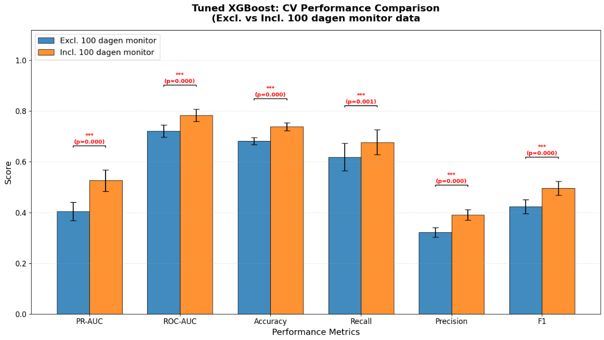

# Investigating 100 Dagen Monitor Data on Predicting Student Drop-out Model Performance

| | |
|---|---|
| **Author** | Fraukje Coopmans & Bouba Ismalia |
| **Date** | 2026-03-20 |
| **Status** | In Progress |

---

## 1. Problem statement
Currently the performance of the student drop-out prediction model is below our target metrics (i.e. recall < 75%, precision < 60% and F1 < 65%), hindering our ability to effectively identify at-risk students. We believe that the model's performance can be improved by incorporating additional data sources, such as the student behavior data collected in the 100 Dagen Monitor. 

## 2. Hypothesis
Student behavior data from the 100 Dagen Monitor significantly improves the performance of the student drop-out prediction model, leading to higher recall, precision, and F1-score compared to the current model without this data.

## 3. Background & Context
The 100 Dagen Monitor is a questionnaire that collects data on various aspects of student behavior, including engagement, support, stress, and motivation. Based on literature adding student behavior data, such as collecting in the 100 Dagen Monitor, can potentially improve a model's ability to predict drop-out cases. 

## 4. Data
The 100 Dagen Monitor datasets contain 2 seperate files for each year, one containing the questionnaire responses and one containing the corresponding student information. The questionnaire consists of about 100 questions (depending on the year). 

We have manually selected the following subset of questions from the 100 Dagen Monitor:

The only criterium for selecting these questions was that they were present in all year 2021, 2022 and 2023 of the 100 Dagen Monitor data. Future work should involve a more systematic approach to selecting the most relevant questions for predicting drop-out cases.

## 5. Methods
- Topics with multiple questions were aggregated by calculating the mean of the responses to those questions. 
- Feature added: response type (Complete-responder, Partial-responder, Non-responder) to account for the different response types. 
- From the all the student data, we only included students who participated in the 100 dagen monitor.

### 5.1 Preprocessing
Two changes were made to the ML pipeline to incorporate the 100 Dagen Monitor data:
- CV-10 was reduced to CV-5
- Low-frequency categories threshold was lowered from 100 to 50 to retain more information from the 100 Dagen Monitor data.

### 5.2 Model(s)
In a previous experiment, we had found that the best performing model for predicting student drop-out was XGBoost. Therefore, we used XGBoost as our primary model for this experiment. We ran an XGBoost using stratified CV-5 with the 100 Dagen Monitor data and once without it and performed hyperparameter tuning for both models and then evaluated the performance of the two models.

### 5.3 Evaluation Metrics
The two models will be evaluated using the following metrics:
- Recall
- Precision
- F1-Score
- PR-AUC
- ROC-AUC
- Accuracy
e will calculate the mean and standard deviation of these metrics across the CV-5 folds to assess the model's performance and stability.

## 6. Results
Drop-out among the students who participated in the 100 Dagen Monitor was 18.9%, which is a lot lower than the overall drop-out rate of 36.4% in the entire dataset. This suggests that students who participated in the 100 Dagen Monitor may be less likely to drop out, which could potentially bias the results of our model performance evaluation.

### 6.1 Performance Comparison

| Metric    | Excl. mean | Incl. mean | p-value | Sig. |
|-----------|------------|------------|---------|------|
| PR-AUC    | 0.4049     | 0.5260     | 0.0000  | ***  |
| ROC-AUC   | 0.7212     | 0.7833     | 0.0000  | ***  |
| Accuracy  | 0.6816     | 0.7385     | 0.0000  | ***  |
| Recall    | 0.6188     | 0.6774     | 0.0007  | ***  |
| Precision | 0.3224     | 0.3906     | 0.0000  | ***  |
| F1        | 0.4236     | 0.4951     | 0.0000  | ***  |

## 7. Discussion

### 7.1 Hypothesis Verdict

- The results show that the model including the 100 Dagen Monitor data significantly outperforms the model without it across all evaluated metrics, with p-values < 0.001. This supports our hypothesis that incorporating student behavior data from the 100 Dagen Monitor can improve the performance of the student drop-out prediction model.

### 7.2 Limitations
- Low response rate in the 100 Dagen Monitor may lead to biased results.
- The selected subset of questions may not capture all relevant aspects of student behavior. Performance improvements may be possible when using a more systematic approach to selecting the most relevant questions for predicting drop-out cases.
- The model's performance may not generalize well to students who did not participate in the 100 Dagen Monitor, which limits the applicability of the model in real-world settings.

## 8. Next Steps

Add 100 dagen monitor data to the entire dataset and evaluate the performance of the model on the entire dataset, including students who did not participate in the 100 Dagen Monitor.