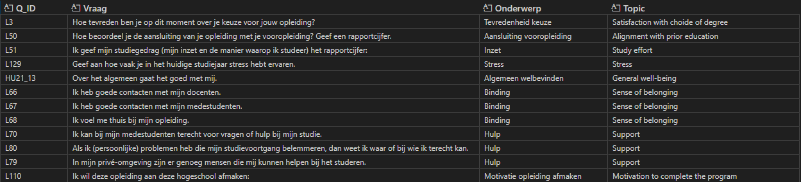

# Investigating 100 Dagen Monitor Data on Full Predicting Student Drop-out Model Performance

| | |
|---|---|
| **Author** | Fraukje Coopmans & Bouba Ismalia |
| **Date**   | 2026-03-25 |
| **Status** | In Progress |
---

## 1. Problem statement
In a previous study we have shown that adding 100 Dagen Monitor data to the student drop-out prediction model can improve the performance of the model. However, this was only tested on a subset of the data: students who participated in the 100 Dagen Monitor. In this experiment, we will investigate whether adding 100 Dagen Monitor data to the entire dataset can improve the performance of the ful student drop-out prediction model.

## 2. Hypothesis
Student behavior data from the 100 Dagen Monitor significantly improves the performance of the student drop-out prediction model, leading to higher recall, precision, and F1-score compared to the current model without this data.

## 3. Background & Context
The 100 Dagen Monitor is a questionnaire that collects data on various aspects of student behavior, including engagement, support, stress, and motivation. Based on literature adding student behavior data, such as collecting in the 100 Dagen Monitor, can potentially improve a model's ability to predict drop-out cases. 

## 4. Data
The 100 Dagen Monitor datasets contain 2 seperate files for each year, one containing the questionnaire responses and one containing the corresponding student information. The questionnaire consists of about 100 questions (depending on the year). 

We have manually selected the following subset of questions from the 100 Dagen Monitor:

The only criterium for selecting these questions was that they were present in all year 2021, 2022 and 2023 of the 100 Dagen Monitor data. Future work should involve a more systematic approach to selecting the most relevant questions for predicting drop-out cases.

## 5. Methods
- Topics with multiple questions were aggregated by calculating the mean of the responses to those questions. 
- Feature added: response type (Complete-responder, Partial-responder, Non-responder) to account for the different response types. 
- All the student data was included, including those students who did not participate in the 100 dagen monitor.

### 5.1 Preprocessing
Two changes were made to the ML pipeline to incorporate the 100 Dagen Monitor data:
- > CV-5 (from experimentation) was changed back to CV-10
- > Low-frequency categories threshold was changed back from 50 to 100 (50 was only for experimentation). 

### 5.2 Model(s)

### 5.3 Evaluation Metrics
The two models will be evaluated using the following metrics:
- Recall
- Precision
- F1-Score
- PR-AUC
- ROC-AUC
- Accuracy
We will calculate the mean and standard deviation of these metrics across the CV-5 folds to assess the model's performance and stability.

## 6. Results

### 6.1 Performance Comparison

## 7. Discussion

### 7.1 Hypothesis Verdict

### 7.2 Limitations

## 8. Next Steps
