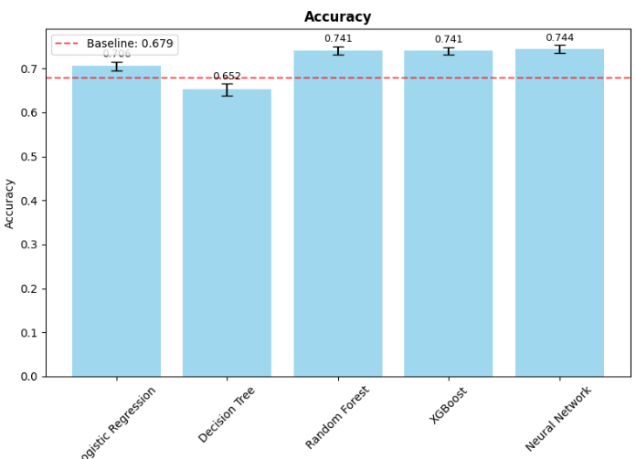
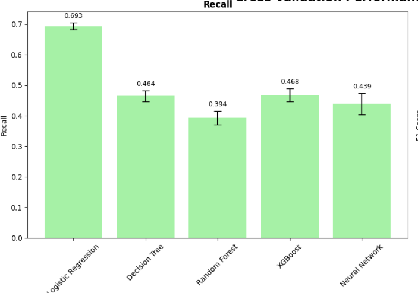
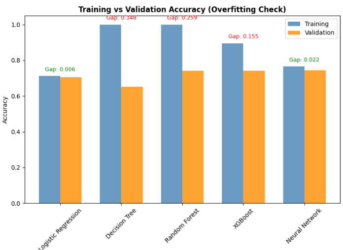
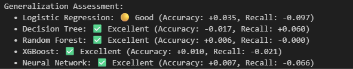
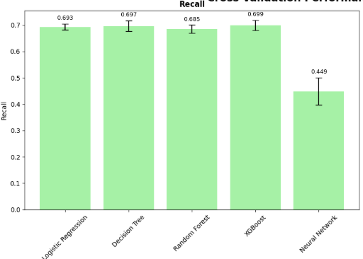
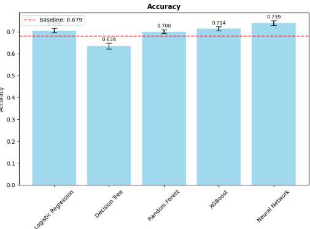

# Model selection logbook
Documents which steps have been taken to investigate which ML model fits the student drop-out data best. 

## Jan-14 (2026)
There are 5 models included for experimentation, which are (listed in increasing complexity):
- **Logistic Regression** - Linear baseline
- **Decision Tree** - Interpretable non-linear model
- **Random Forest** - Ensemble method for robust predictions
- **XGBoost** - Gradient boosting ensemble method
- **Neural Network (MLP)** - Non-linear deep learning approach

The dataset shape is (21595, 89). 
The combined train+val shape for cross-validation: (14232, 87). 

Class distribution in the cross-validation dataset:
0    0.679033
1    0.320967

All models have been set-up with standard (i.e. default) settings. 
The scoring metric to minimize during model training are the following:
   - accuracy
   - roc_auc
   - f1
   - recall
   - precision

For training and cross-validation stratified CV-10 is used. 

### Results
Investigating the different individual metrics, it is noticeable that the more complex models (random forest, XGBoost and neural networks) score highest on accuracy (0.74) of all models, whereas logistic regression scores just above baseline (0.71). 



When looking at recall, i.e. how many of the drop-out students is a model able to correctly identify, logistic regression performs best (recall = 0.69) with the other models scoring far worse (recall < 0.47). 



It is striking that the more complex models seem to perform poorly on recall, and it might indicate that the complexer models overfit on the training data. When investigate this we indeed find that the accuracy during training is 'perfect' (i.e. 1.00) for the complex models (except for neural networks) and drops greatly during validation:



This indicates that it might be worthwhile to take appropriate measures to reduce overfitting in the decision tree, random forest and XGBOost models. The proposed next steps are:
- try out less features
- try to fit these models less long (e.g. less steps, less branches, smaller size, etc.)
- change the scoring metric to minimize to recall or f1-macro
- try out models on test data

#### Side notes

- Logistic regression has a problem with converging. Work is needed to investigate. 
- Both logistic regression, XGBoost and neural networks models seem to rely heavily (high relative feature importance) on the 'Degree Dental Hygiene' and/of 'Degree Dermal Therapy' feature. I would not expect that a specific degree would have such a high feature importance: to me it seems indicative to overfitting. We could try to adjust the model regularization to allow for better generalization. 


## Jan-16: Test generalization of models
Added a section that trains all models on the full training set and then evaluates each model's performance on the test dataset. 

### Results
Interestingly, the metric results for accuracy and recall show similar results for the test data as compared to the cross validation data, so the generalization of the different models is quite good:



## Jan-16: 
Before we can evaluate the different models to choose a best model we need to address the overfitting that is happening in some models (i.e. decision model, random forest, XGboost). We have been using the default configuration for each model, but for the mentioned models this leads to overfitting: we observe a large gap in accuracy between training and validation for these models. 

To reduce overfitting Richard suggest to try a model configuration with less complexity (e.g. smaller size, less depth, etc.): to do this, we have Claude suggest a balanced configuration that reduces overfitting. This configuration is just an experiment to see if a different configuration can reduce overfitting and improve recall of the affected models. 

The following model settings were chosen:
```python
'Decision Tree': DecisionTreeClassifier(
        random_state=42,
        class_weight='balanced',
        max_depth=12,               # Moderate depth limit
        min_samples_split=30,       # Moderate split threshold
        min_samples_leaf=15,        # Moderate leaf threshold
        max_features='sqrt',        # Standard feature limitation
        min_impurity_decrease=0.005 # Small improvement requirement
    ),
    'Random Forest': RandomForestClassifier(
        random_state=42,
        class_weight='balanced',
        n_jobs=-1,
        max_depth=12,               # Moderate depth limit
        min_samples_split=30,       # Moderate split threshold
        min_samples_leaf=15,        # Moderate leaf threshold
        max_features='sqrt',        # Default feature limit
        max_samples=0.9             # Use 90% of samples
    ),
    'XGBoost': XGBClassifier(
        random_state=42,
        eval_metric='logloss',
        verbosity=0,
        n_jobs=-1,
        scale_pos_weight=scale_pos_weight,
        max_depth=5,                 # Moderate depth limit
        learning_rate=0.08,          # Slightly slower learning
        n_estimators=80,             # Moderate number of trees
        reg_alpha=0.3,               # Moderate L1 regularization
        reg_lambda=1.5,              # Moderate L2 regularization
        subsample=0.85,              # Use 85% of samples
```

### Results
Changing the configuration improves recall tremendously for the decision model, random forest and XGBoost models. See below the recall for each model after the configuration was changed (before the configuration change recall for the middle three models was < 0.46):



While recall increases for these models, the accuracy seems to decrease slightly which is expected when a model diverges from an overfitting mode. Previous values for accuracy for the decision model, random forest and XGBoost models were 0.65, 0.74 and 0.74 respectively. Values after the new configuration was applied can be found here:



 #### Side notes
 The metric results of the logistic regression model are not affected by changing its configuration to avoid overfitting, as well as the neural network: recall and/or accuracy did not increase or decrease significantly. Notably, the neural network has quite a low recall score (0.45) compared to the other models (0.68-0.69). 

 The configuration of the neural network does not adjust for class imbalance yet, so this is an improvement needed that most likely will improve recall for this model type. 

 When looking at feature importance, each model seems to focus on a different variety of features. The features regarding student results (i.e. total credits and average grade) are on average most important. 

 The current decision tree model uses only 1 feature (sdo6_results_Total_Credits_Block_A) ...

 #### Suggested next steps
 Adjust for class imbalance in the neural network, then choose best model. Proceed with tuning hyperparameters. 